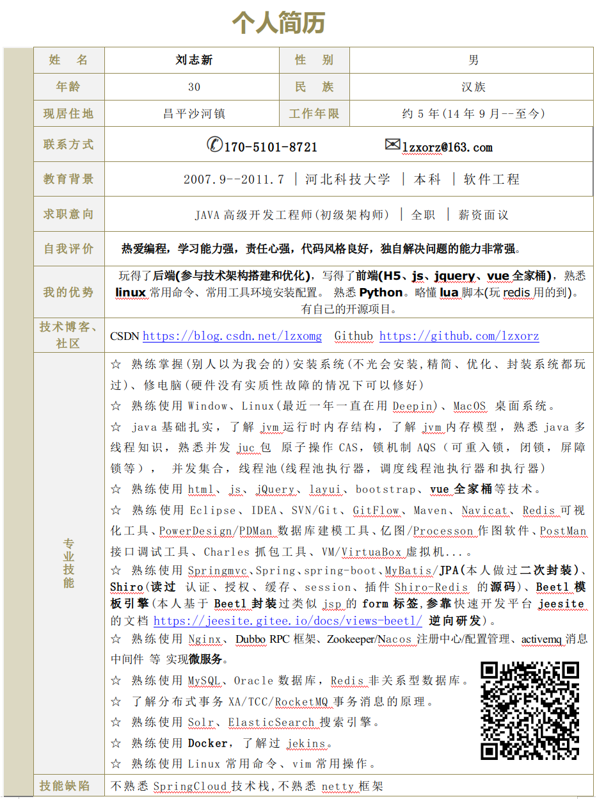
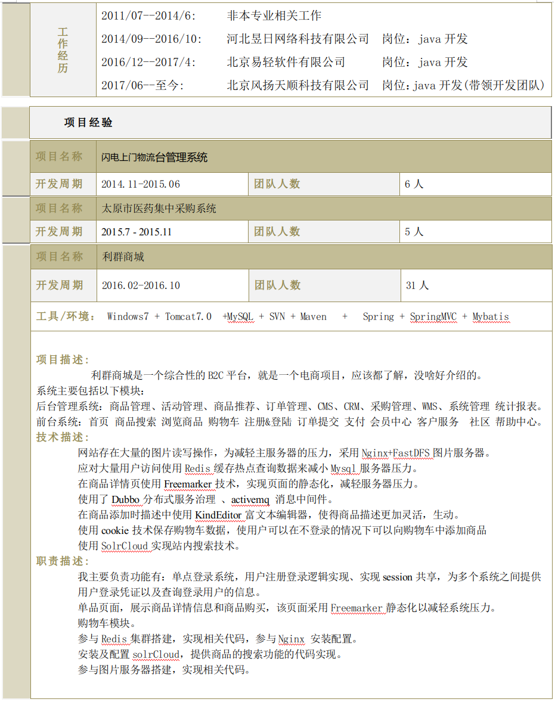
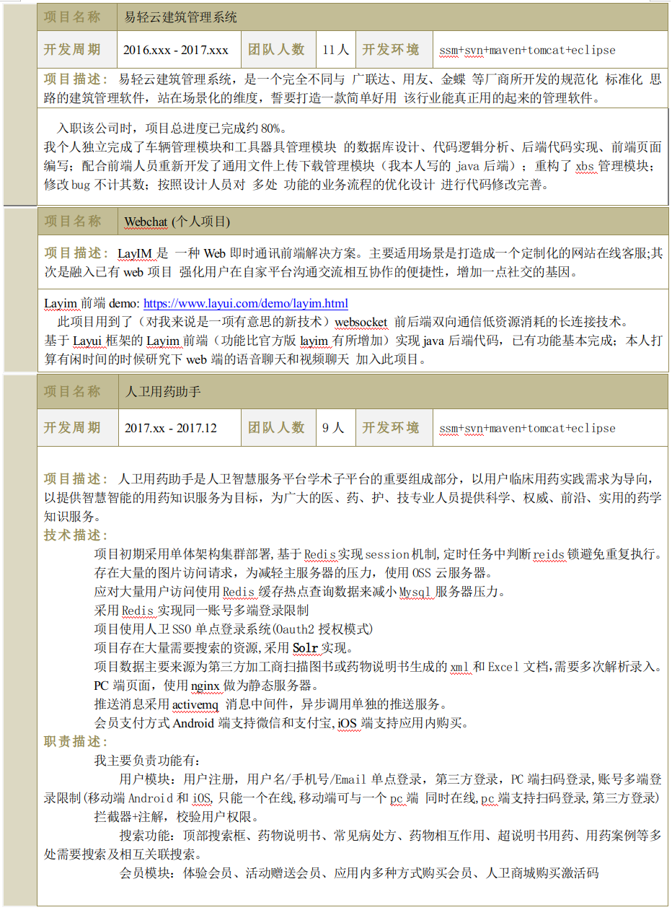
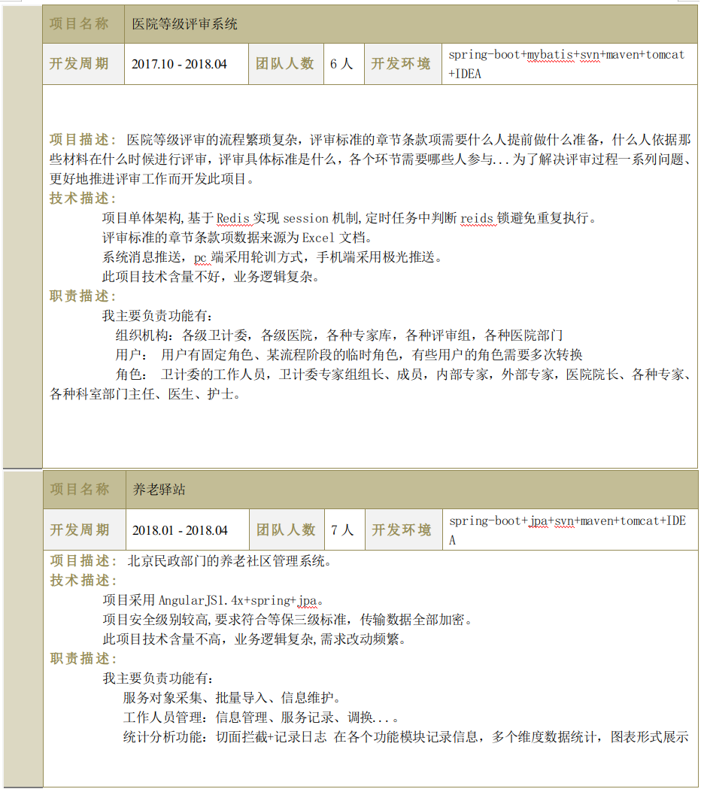
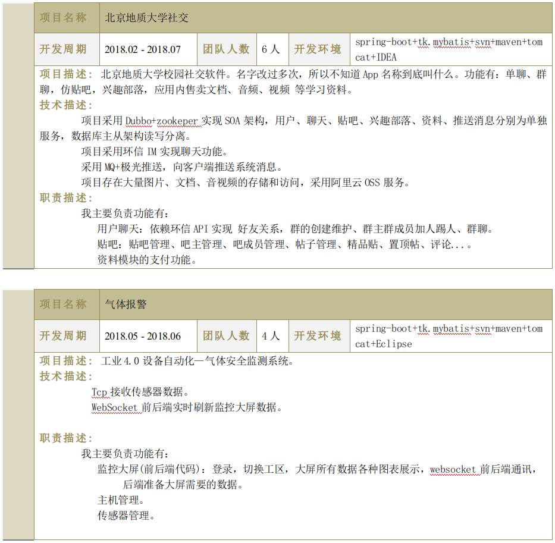
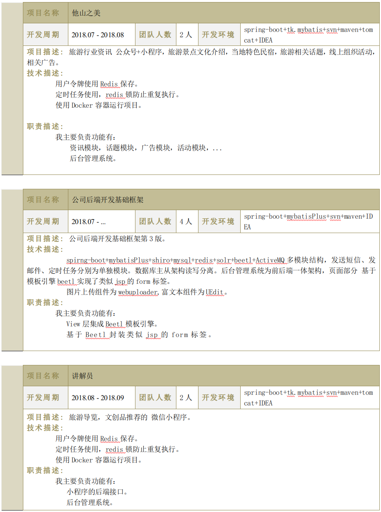
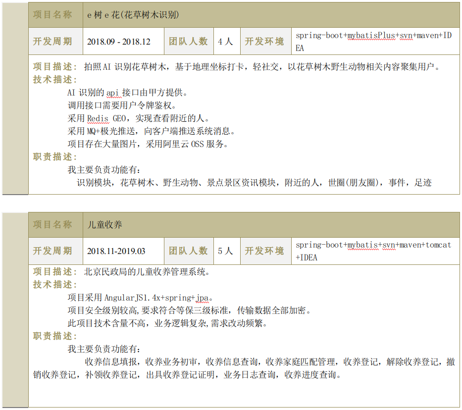
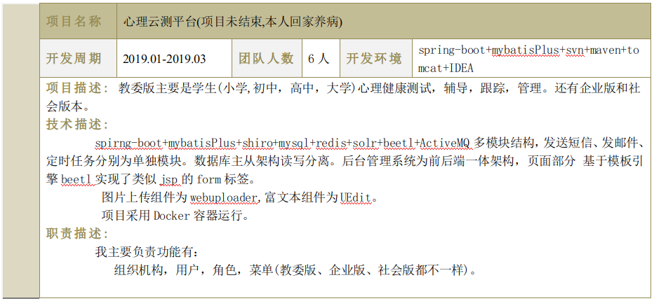
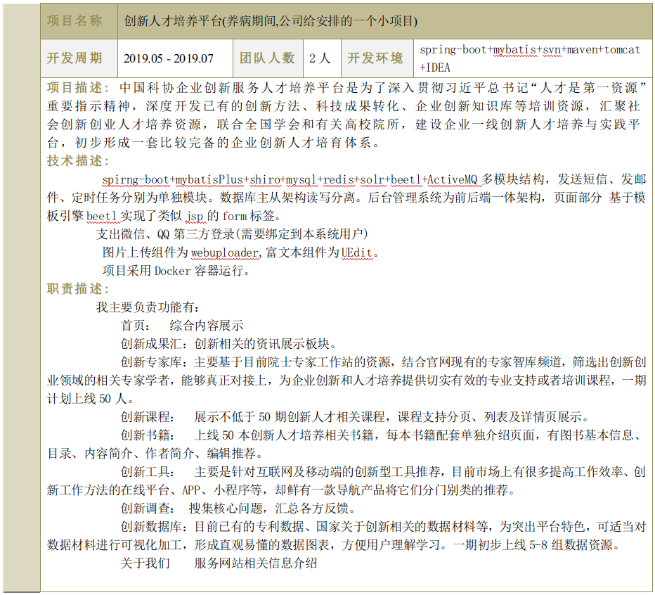
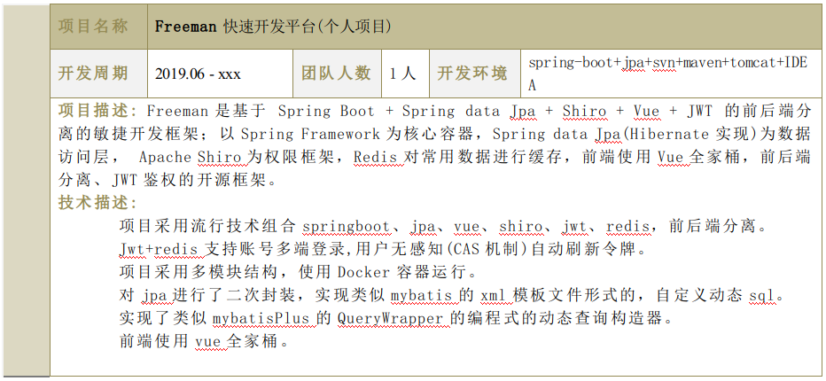

# 刘志新的个人简历

|技术博客/开源平台| 访问地址 | 说明 |
|:-------:|:------------------------------|:------------------------------|
| CSDN |[https://blog.csdn.net/lzxomg](https://blog.csdn.net/lzxomg)|有写博客的习惯|
| 码云 |[https://gitee.com/lzxorz](https://gitee.com/lzxorz)|有个人开源项目|
| Github|[https://github.com/lzxorz](https://github.com/lzxorz)|有个人开源项目|
| Freeman|[https://github.com/lzxorz/freeman](https://github.com/lzxorz/freeman)|个人开源项目(完成70%)|

---

